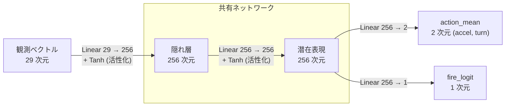

TODO: まえがき: 前回はレンダリングの話をした。でも、ゲームと言えばやっぱり AI だよね。

NOTE: リポジトリ: https://github.com/sashi0034/toy-acai

# はじめに

本記事では、自作ゲームで深層強化学を用いた AI を開発する手法について検討・実装します。

具体的には、C++ で記述したゲームロジックを Python から呼び出せるように拡張を行い、PyTorch を用いて機械学習を行います。

その上で、ゲームを機械学習をする上でエンジン側にどういう機能があれば嬉しいかについて考えてみます。

私自身は機会学習に関しては齧っただけの門外漢なので、鵜呑みにせず参考程度に読んでもらえれば幸いです。


# 動機

TODO: ルールベース AI を作るのは割としんどい

# 題材設定

今回題材にするのは、2 次元フライトシューティングゲームの AI です。

ゲームとしては、2D 平面上を戦闘機が移動し、敵機を追尾しながらミサイルを発射して撃墜を狙うというものです。厳密な航空力学シミュレーションではなく、あくまで「空戦っぽい挙動をするゲーム」として実装しています。単に今回の学習用に作ったプロトタイプなので、ゲーム自体は正直つまんないです。

このテーマにした理由は、今年発売予定の ACE COMBAT 8 が待ちきれなかったので、戦闘機の AI を作ってエース気分を味わおうと思ったからです。あと、`Aircraft` 最初の 2 文字が `AI` なので今回のテーマにちょうどいい気がしました。

今回は実際のゲーム開発を想定し、ゲームロジックの実装は C++ で行いました。

プレイヤーや AI が操作する機体は次の 3 つの入力を毎フレーム受け取ります。

```cpp
struct FighterInput
{
    double acceleration; // 加減速 [-1.0, 1.0]
    double turn;         // ヨーイング [-1.0, 1.0]
    bool fire;           // ミサイル発射
};
```

各機体は加減速、旋回、ミサイル発射入力が行えます。ミサイル発射後は一定時間のクールダウンが発生するため、毎フレーム無限にミサイルを撃てるわけではありません。ミサイルは簡易的なホーミング機能もあります。

戦闘機の状態は以下のような構造体で表現しています。

```cpp
struct FighterState
{
    int teamId;      // 0 だったら自軍、1 だったら敵軍
    int memberId;    // チーム内識別 ID (0-origin)
    Vec2 position;   // 戦場内の座標
    double yaw;      // 機体の向き
    double speed;    // 機体の速度
    // (中略)
};
```

機体の撃墜判定については、次の仕様にしました。

- ミサイルが一発当たったとき
- 戦闘領域 (長方形) を出てから 3 秒以上経過したとき (画面外で戦闘が起こらないようにするため導入)

戦場全体は `BattlefieldContext` で表現します。`InitBattlefield(context)` で初期化をします。

`BattlefieldContext` の更新は、以下の関数を毎フレーム呼び出して行います。この更新関数では描画は行いません。

```cpp
void UpdateBattlefield(
    BattlefieldContext& context,
    const std::array<FighterInput, FighterCount>& inputs,
    double deltaTime
);
```

`BattlefieldContext` の描画は別途 `BattlefieldRenderer` というクラスに切り分けました。`BattlefieldContext` は戦場の状態だけを持つ構造体であり、描画関連の要素を一切持ちません。これにより、描画無しでゲームロジックを進めることが出来るようになるので、大量のエピソードを走らせる強化学習が回りやすくなります。

描画画面は以下のようになります。

TODO: ここに画像挿入

今回、個人的な好みで描画には Siv3D というエンジンを使用しました。Siv3D は C++ で手軽に 2D/3D 描画や入力処理を扱えるライブラリで、今回のような小規模なゲームプロトタイプを作るにはかなり便利です。

また、描画については GPU を使った通常のハードウェアレンダリングだけでなく、CPU のみで可能なソフトウェアレンダリングにも対応させました。今回学習に利用した計算機環境では GPU は使えるものの、GUI アプリケーションを表示するディスプレイ環境が用意されていなかったためです。手元の開発環境では標準のハードウェアレンダリング (OpenGL) で可視化し、学習用の計算機環境では確認用に必要に応じてソフトウェアレンダリングを使う形にしました。Siv3D のレンダリングバックエンドに "DirectX", "OpenGL" と並んで "ソフトウェアレンダリング" というオプションがあるわけではないのですが、今回はエンジン側を改造せずにアプリケーション側で描画処理を一段階抽象化することで行っています。

また、描画については、GPU を使った通常のハードウェアレンダリングだけでなく、CPU のみで動作するソフトウェアレンダリングにも対応させました。今回学習に利用した計算機環境では GPU 自体は利用できるものの、GUI アプリケーションを表示するためのディスプレイ環境が用意されていませんでした。そのため、手元の開発環境では標準のハードウェアレンダリング (今回は OpenGL バックエンド) を使って可視化し、学習用の計算機環境では必要に応じてソフトウェアレンダリングで確認用の画像を出力する形にしました。実装について、Siv3D のレンダリングバックエンドに `DirectX` や `OpenGL` と並んで `ソフトウェアレンダリング` という選択肢があるわけではないのですが、今回は Siv3D 本体を改造するのではなく、アプリケーション側で描画処理を一段階抽象化して通常の画面描画と確認用のソフトウェア描画を切り替えられるようにしています。

学習時には、Python 側から C++ のゲームロジックを呼び出し、現在の状態を取得します。その状態を機械学習用の観測ベクトルに変換し、PyTorch で作成したニューラルネットワークに入力します。ニューラルネットワークは `FighterInput` それぞれのパラメータ確率分布を出力します。

サンプルした行動を再び C++ 側に渡してゲームを 1 ステップ進め、得られた報酬をもとに学習を進めます。

大まかな構成をまとめると、次のようになります。

```txt
C++ 側: ゲームロジック
  ├─ 機体やミサイルの状態更新などのシミュレーション
  ├─ Siv3D による描画
  └─ Python から呼び出すためのバインディング

Python 側: 学習
  ├─ 観測の整形
  ├─ 方策ネットワーク
  ├─ 報酬計算
  ├─ 学習ループ
  └─ 評価・可視化
```

今回の記事では、この 2D フライトシューティングゲームを題材にして C++ で実装したゲームロジックを Python から操作し、深層強化学習によって AI を学習させる流れを見ていきます。


# C++ ゲームロジックを nanobind を用いて Python から扱う方法について

まず初めに、今回どうして C++ だけで完結させずに Python を使うのかについて整理します。

主な理由は、機械学習ライブラリ (今回は PyTorch) を利用するためです。機械学習の実装は自前で素直な実装出来ますが、世の中で広く使われているライブラリよりも優れたパフォーマンスの実装にするには非常に困難です。機械学習は 1 回の学習の結果が出るまで 1 日では終わらないことも多く、その上でパラメータやモデル設計の試行錯誤が何度も必要です。そのため、PyTorch のような成熟して優れた実行性能のライブラリを使うことにより、限られた時間より多くの実験を試すことが出来ます。

C++ と Python を連携させる方法はいくつかありますが、大まかには次のような選択肢が考えられます。

1. **C++ 側のプログラムを外部プロセスとして起動し、標準入出力やソケットを介して Python と通信する**

   C++ プロセスと Python プロセスを JSON 形式などで状態データや入力データをやり取りします。実装自体は簡単ですが、毎フレーム状態をシリアライズして送受信する必要があるので、長時間稼働では通信やシリアライズのオーバーヘッドのコストが無視出来なくなってしまいます。

2. **C++ 側のプログラムを外部プロセスとして起動し、メモリ領域を Python と共有する (共有メモリ)**

   C++ と Python の両方から参照できる共有メモリ領域を用意する方法です。C++ 側の構造体レイアウトをバイナリとして Python 側から読むので、実装やデバッグが煩雑になりやすいです。同期やライフタイム管理などの設計も大変です。

3. **C++ の型や関数を Python が扱えるようにバインディングし、Python から C++ の処理を呼び出す**

今回は 3 つめの手法を選びました。理由は、Python 側のコードがシンプルになって開発しやすくなり、その上パフォーマンスも優れているからです。バインドした C++ モジュールを Python 側で import することにより、普段と同じ感覚で Python コードを書けるようになります。C++ 関数呼び出しは同じプロセス内で実行されるので、シリアライズのような変換コストは無い上にや煩雑なバイナリ読み書きなどは必要ありません。

バインディングライブラリの定番の選択肢として、pybind11 があります。pybind11 は C++ と Python のバインディングライブラリとして広く使われており、PyTorch や TensorFlow でも使われているようです。

ですが、今回は nanobind というライブラリを使いました。nanobind は pybind11 と同じ作者が開発したライブラリみたいです。

nanobind は pybind11 とよく似た書き味を保ちつつ、よりモダンな C++ と Python を前提にして設計されています。公式ドキュメントによると、nanobind は pybind11 よりもビルド時間が短くなり、生成されるバイナリサイズは小さく、実行時オーバーヘッドも改善されているようです。

例えば、以下の C++ コード例では `add()` 関数と `Counter` クラスを Python で扱えるようにバインドします。

```cpp
#include <nanobind/nanobind.h>

namespace nb = nanobind;

int add(int a, int b)
{
    return a + b;
}

struct Counter
{
    int value;

    Counter(int initial_value) : value(initial_value) { }

    void plus(int x) { value += x; }

    int get() const { return value; }
};

NB_MODULE(my_module, m) // モジュール名 `my_module` でバインド
{
    m.def("add", &add);

    nb::class_<Counter>(m, "Counter")
        .def(nb::init<int>())
        .def("plus", &Counter::plus)
        .def("get", &Counter::get)
        .def_rw("value", &Counter::value);
}
```

これをビルドしたモジュールについて、Python で次のように呼び出せます。

```python
import my_module

print(my_module.add(1, 2))  # 3

counter = my_module.Counter(10)
print(counter.value) # 10
counter.plus(5)
print(counter.get()) # 15
```

このように、C++ で定義した関数を簡単にバインドすることが出来ました。

さらに、CMakeLists.txt 内で `nanobind_add_stub()` を用いることで `.pyi` 型スタブを生成することも出来ます。`.pyi` を作っておけばエディタで自作モジュールのシンボル補完が効くようになります。

さて、今回のプロジェクトでは、C++ 側で定義した関数を出来るだけ同じノリで Python でも使えるようにしてみました。
既存のゲームロジックに近い単位をそのまま Python から扱えるようにする方針です。つまり、Python 側で `BattlefieldContext` を作成し、それを `init_battlefield()` で初期化し、毎フレーム `update_battlefield()` に入力を渡して更新する構成です。

例えば、C++ で記述した以下のコードを対応付けてみます。

```cpp
BattlefieldContext battlefield;
InitBattlefield(battlefield);

// 戦闘機: 0 の初期位置を調整
battlefield.fighters[0].position.x = 100.0;
battlefield.fighters[0].position.y = 200.0;

// 入力列を作る
std::array<FighterInput, FighterCount> inputs{};
for (auto& input : inputs)
{
    input = FighterInput{ 0.0, 0.0, false };
}

UpdateBattlefield(battlefield, inputs, 1.0 / 60.0);
```

Python では 同等の処理を以下のように書けます。

```python
import toy_acai_core as core # C++ ゲームロジックのモジュール

battlefield = core.BattlefieldContext()
core.init_battlefield(battlefield)

# 戦闘機: 0 の初期位置を調整
battlefield.fighters[0].position.x = 100.0
battlefield.fighters[0].position.y = 200.0

# 入力列を作る
inputs = [
    core.FighterInput(0.0, 0.0, False)
    for _ in range(core.FIGHTER_COUNT)
]

core.update_battlefield(battlefield, inputs, 1.0 / 60.0)
```

このように、Python 側も C++ 側と同じ API でコーディング出来るようにすることで、Python 側の開発をスムーズに進めることが出来るようになりました。

# Siv3D 内部コードの変更

ここまで、C++ で実装したゲームロジックを Python から呼び出すための仕組みについて説明してきました。

ただし、実際にやってみると、単に C++ のクラスや関数をバインドするだけでは済まない部分もありました。具体的には、Python から C++ モジュールを呼び出す構成にしたことにより、通常の Siv3D アプリケーションと異なる構造による弊害が生じてしまいました。

通常の Siv3D アプリケーションでは、ユーザーは `Main()` 関数を定義し、その中でアプリケーション本体のコードを書きます。Siv3D 側では、この `Main()` が呼ばれる前後でエンジンの初期化や終了処理が行われます。そのため、通常の使い方ではユーザーが明示的にエンジンの初期化処理を呼ぶ必要はありません。

しかし、今回作っているのは通常の実行ファイルではなく、Python から `import` して使うための拡張モジュールです。nanobind でビルドされるモジュールは、Python から読み込まれる動的ライブラリであり、単体のアプリケーションとして起動されるわけではありません。

そのため、通常の Siv3D アプリケーションのように `Main()` 関数が呼び出されません。

これが問題になるのは、多くの Siv3D 機能がエンジン初期化後に使われることを前提としているためです。今回の実装では、学習中の様子を確認するために描画処理も用意しており、その中ではフォント描画を使っていました。しかし、Python から C++ モジュールを呼び出す構成では通常の初期化経路を通らないため、ソフトウェアレンダリングにおいても描画まわりの機能が正しく使えないという問題が起きました。

そこで、Siv3D 本体を改造し、`MainRuntime` というエンジンの初期化と終了処理を RAII で管理するクラスを作った。インスタンスを生成すると Siv3D の実行に必要な初期化が行われ、スコープを抜けて破棄されると終了処理が行われます。

通常の Siv3D アプリケーションは次のようにアプリケーションの処理を記述しました。

```cpp
void Main()
{
    // Siv3D API を使う処理
}
```

今回の実装により、次のようにも書けるようになりました。

```cpp
void my_main()
{
    MainRuntime mainRuntime{};

    // Siv3D API を使う処理
}
```

つまり、`Main()` をエントリーポイントにできない場合でも、明示的に Siv3D の実行環境を作れるようにしました。

今回のように Python 側がプログラム全体のエントリーポイントを持ち、C++ 側は Python から呼び出されるモジュールとして動く場合でも `MainRuntime` によって Siv3D API を利用できるようになりました。

ついでに Siv3D の Linux 実装に関する修正も行なったのですが、本題から脱線するので記事末尾に記述します。


# 強化学習の簡単な説明

この章から今回の強化学習の実装について説明します。

まず今回の実装を通じた個人的な感想として、強化学習は思ったよりも難しいと思いました。
以前、私は Transformer アーキテクチャを学んで簡単な LLM を作ってみたのですが、それに比べると今回の開発はかなり難航しました。
LLM 開発で上手く行かないときは AI と相談しながら問題点や改善案を検討し、実装も AI エージェントに丸投げするだけでそれなりのものが作れたのですが、今回の強化学習は AI 丸投げでは上手く行かず、自力で試行錯誤しないと解決出来なかった場面が多かったです。
それを踏まえて強化学習の概要について考えてみます。

強化学習で難しいのは、一般的な教師あり学習とは違って「正解の行動」が分からないことです。
例えば文字認識の場合、入力画像に対して「これは 3 である」「これは 8 である」といった正解ラベルを用意できます。
学習対象であるパラメータは正解との損失を求めて誤差伝搬法で逆伝搬することで更新できます。

一方、ゲームの場合は状況の中で最善手が何かというのを決定するのは困難です (そもそも最善手が分かるなら学習が必要無いですね)。
例えば将棋の場合、相手の駒を取るだけの行動が必ずしも正解につながるのではなく、あえて自分の駒を取らせて別の手を指すことが有力なこともあります。
ある状況の中でどういう行動が正解なのかをルールベースで判断するのは難しいです。

そこで強化学習では、行動そのものの正解を直接与える代わりに、行動の結果として得られる報酬を与えて学習します。良い行動を取れば高い報酬が得られ、悪い行動を取れば低い報酬、あるいはペナルティが与えられます。AI は将来に獲得する報酬を最大化するように行動します。
この報酬を手がかりに、どのような状態でどのような行動を取るべきかを学習していきます。

強化学習の代表的な手法の一つに Q 学習があります。Q 学習では、状態 $s$ で行動 $a$ を取ったときの価値を $Q(s, a)$ として表します。ある状態における Q 値が正確に分かっているなら、その状態で取るべき行動は、Q 値が最も大きくなるものを選べばよいことになります。
Q 値は、次のような単純な式で更新されます (これ自体はニューラルネットワークを使いません)。

$$
Q(s, a) \leftarrow Q(s, a) + \alpha \left( r + \gamma \max_{a'} Q(s', a') - Q(s, a) \right)
$$

$r$ は即時報酬、$s'$ は次の状態、$\alpha$ は学習率、$\gamma$ は将来の報酬をどれくらい重視するかを表す割引率です。簡単に言えば、「今の Q 値」と「実際に行動してみて分かった価値 ($r + \gamma \max_{a'} Q(s', a')$)」との差を使って、少しずつ Q 値を修正していく方法です。何度も繰り返すうちにある地点の報酬が伝搬していって一定の値へ収束します。この式自体は深層学習における更新 (誤差伝搬法) とは無関係なことに注意してください。

迷路探索のような小さな問題であれば、状態と行動の組み合わせごとに Q 値をテーブルとして持つことができます。
しかし、状態数が非常に多い問題では、Q 値をテーブルで持つ手法は上手くいきません。テーブルが大きくなって学習が進みにくくなったり、そもそもメモリに収まりきらないほどテーブルが大きくなってしまいます。
そこで出番となるのがおなじみの深層学習です。テーブルで Q 値を完璧に覚えておくのではなく、ニューラルネットワークを使って Q 値のものを推論するようにします。ニューラルネットワークの更新に用いる損失を数式で表現すると次のようになります。

$$
y = r + \gamma \max_{a'} Q(s', a'; \theta^-)
$$

$$
損失(\theta) = \left( y - Q(s, a; \theta) \right)^2
$$

しかしながら、この手法は行動 $a$ が離散的であることを前提にしています。
2D RPG のように入力が「上・下・左・右」移動しかないゲームであれば問題ないのですが、今回のゲームでは「加減速・旋回」といった入力値が float の連続値として表されます。このような連続的な行動を無理やり離散化することもできますが、離散化の粒度を粗くすると細かな操作を表現できなくなり、逆に細かくすると候補となる行動数が増えすぎて計算量が大きくなってしまいます。

そこで今回は、「状態と行動から価値を出力して次の行動を選択する」のではなく、「状態から行動そのものを直接出力」することにします。これは **方策勾配法** と呼ばれる考え方です。Q 値を学習対象にするのではなく、ニューラルネットワークに現在の状態を入力し、確率関数を出力として「加減速・旋回・ミサイル発射」といった行動を決定します。

ここで、特に重要になるのが報酬設計です。単なる「勝ち・負け」だけを報酬として与える場合、どういった行動が優れているかということが学習されずらくなってしまって時間をかけても学習が一向に進まなくなってしまうことがあります。
そのため、エージェントの行動に対する報酬を与えます。例えば、敵に近づいたときの報酬、撃墜したときの報酬、場外に出たときのペナルティなどを指定します。こういった報酬設定を少し変えるだけで学習の進み方は大きく変わります。

前述の通り、強化学習の実装を AI に丸投げするだけでは学習がうまく進まないことがよくあります。実装当時の最上位モデル Claude Opus 4.8 を使っても学習が改善するどころか悪化することさえよくありました。実装の良し悪しの評価は学習を始めて数時間を要することもあり、「結果が良くなるまで AI エージェントを動かしっぱなしにする」っていうのもやりづらいです。よって、ある程度人力でアルゴリズムを改善したり、ハイパーパラメータや報酬を調整したりして試行錯誤する必要がありました。こういった工夫について次章以降で説明します。


# REINFORCE: PyTorch を用いて実装

方策勾配法とは「状態」をニューラルネットワークに突っ込んで「行動」をサンプルするものだと説明しました。
この章では、方策勾配法の基本的な実装である REINFORCE について紹介したいと思います。


## 導出の概要

REINFORCE のアイデアはシンプルで、「最終的に高い報酬につながった行動の確率を上げ、低い報酬につながった行動の確率を下げる」です。

方策勾配法では、以下の「割引率付き」報酬の総和 (収益 $G_t$) を最大化したい目的関数とします。将来の報酬は割引率 $\gamma$ によって減衰されています (今回の実装では $\gamma = 0.95$)。

$$
G_t = r_t + \gamma r_{t+1} + \gamma^2 r_{t+2} + \cdots
$$

より正確には、以下のように時刻 $0$ から得られる収益 $G_0$ の期待値が目的関数となります。

$$
J(\theta)=\mathbb{E}_{\tau \sim \pi_\theta}[G_0]
$$

ここで $\tau$ は、状態・行動・報酬の時系列データ (軌跡)、$\pi_\theta(a_t \mid s_t)$　は状態 $s_t$ において行動 $a_t$ を選ぶ確率 (方策)　です。方策はニューラルネットワークで表現します。

これをパラメータ $\theta$ で偏微分します。途中式は割愛しますが、式変形の過程で $\log$ が出てくるのが面白い点です。

$$
\begin{aligned}
\nabla_\theta J(\theta)
&=
\nabla_\theta
\mathbb{E}_{\tau \sim \pi_\theta}
\left[
G_0
\right] \\
&=
\mathbb{E}_{\tau \sim \pi_\theta}
\left[
\sum_t
G_t
\nabla_\theta
\log \pi_\theta(a_t \mid s_t)
\right]
\end{aligned}
$$

理想的には無限回試行することで正確な期待値を求めることができますが、実装上は 1 回の更新につき N 回試行した結果を用います。

$$
\nabla_\theta J(\theta)
\approx
\frac{1}{N}
\sum_{i=1}^{N}
\left[
\sum_t
G_t^{(i)}
\nabla_\theta
\log \pi_\theta(a_t^{(i)} \mid s_t^{(i)})
\right]
$$

目的関数 $J(\theta)$ をパラメータ $\theta$ で偏微分した式を表すことが出来ました。これにより、いつもの機械学習と同じノリで逆伝搬してパラメータの更新が可能になりました！


## 全体の擬似コード

前節の数式の通り、方策の log 確率と収益の積 $G_t \times \log \pi_\theta(a_t \mid s_t)$ の総和を $\theta$ で偏微分することによってニューラルネットワークのパラメータに関する勾配計算が出来ることが分かりました。ここまで分かったところで学習の全体像を擬似コードで示してみます。

```python
for update in range(NUM_UPDATES):
    batch_policy_losses = []

    # パラメータ更新 1 回につきシミュレーションを N 回試行する。
    for episode in range(N):
        # 今回の場合、BattlefieldContext が「状態」になる。
        state = BattlefieldContext() # BattlefieldContext 作成
        init_battlefield(state)

        log_probs, rewards = [], []

        # MAX_STEPS フレーム分実行する。
        for step in range(MAX_STEPS):
            # 「状態」をそのままニューラルネットワークに
            # 突っ込むと学習が安定しない。そのため、「状態」から
            # 必要な情報を取り出して観測ベクトルを作る。
            obs = build_observation(state)

            # 観測ベクトルをニューラルネットワークに突っ込んで
            # 行動 (accel, turn, fire) をサンプルする。
            # 同時に、勾配計算のための log 確率も受け取る。
            action, log_prob = policy.sample_action(obs)

            # 各機体へ入力を与える。
            inputs = [FighterInput() for _ in range(FIGHTER_COUNT)]
            inputs[AGENT_INDEX] = to_input(action) # 自機
            inputs[OPPONENT_INDEX] = get_opponent_input(...) # 敵機

            # 入力に基づいて「状態」を更新
            DELTA_TIME = 1.0 / 60
            update_battlefield(state, inputs, DELTA_TIME)

            # 報酬を評価
            reward = evaluate_reward(...)

            log_probs.append(log_prob)
            rewards.append(reward)
            if is_terminal(state):
                # 自機が死んだ場合などは打ち切り
                break

        # 収益計算
        returns = discounted_sum(rewards, gamma)

        # 正規化してから保存
        returns = normalize(returns)
        batch_policy_losses.append(-(stack(log_probs) * returns).mean())

    policy_loss = mean(batch_policy_losses) # 平均化

    # いつもの PyTorch と同じノリで逆伝搬
    policy_optimizer.zero_grad()
    policy_loss.backward()
    policy_optimizer.step()
```

擬似コード内で三重 for ループが登場しますが、最も内側のループでは環境の更新、その外側では N 回のシミュレーション、更に外側ではニューラルネットワークのパラメータを更新しています。

ここで、最後に収益は正規化を行っています。
収益全体から平均を引くことにより、「平均より良かった行動の確率を上げ、平均より悪かった行動の確率を下げる」という効果が期待できます。ベースラインという考え方です。
また、平均 0、標準偏差 1 程度に正規化することで勾配のスケールがある程度揃うようになり、学習を安定させることが出来ます。

一つ注意点として、REINFORCE では報酬を最大化したいのに対し、PyTorch の optimizer は loss を最小化するようになっています。そのため、符号を反転して

```python
-(log_prob * return)
```

という形にします。これにより、高い収益につながった行動の log 確率は大きくなる方向に、低い収益につながった行動の log 確率は小さくなる方向にパラメータが更新されます。


## 方策ネットワークについて

方策のニューラルネットワークについては、以下のような構造になっています。観測ベクトルの中身については後述します。



観測ベクトルをニューラルネットワークに通すことで `action_mean` と `fire_logit` が得られます。
- 加減速の入力は平均 `action_mean[0]` の正規分布、旋回の入力は平均 `action_mean[1]` の正規分布からサンプルして取得します (正規分布の標準偏差の値は適当に固定)。
- ミサイル発射の入力については、logit を `fire_logit` としたベルヌーイ分布からサンプルし、値が 0.5 以上なら「発射」として扱います。

正規分布のサンプルした値は [-1, 1] の範囲に収まっていないこともあるので、 サンプルした `action` の値は $tanh$ を通すことによって [-1, 1] の範囲に制限します。

## 特徴量について

前述の擬似コードでは観測ベクトルを `build_observation()` で作りました。

方策ニューラルネットワークに渡す観測ベクトルの各要素を「特徴量」と呼びます。特徴量の設計には意外と考慮すべき点が多かったため、ここでまとめてみます。

愚直に実装できる観測ベクトルとして、ゲーム状態を丸ごとベクトルにしてしまう方針が考えられると思います。しかしながら、ゲーム状態を丸ごとニューラルネットワークに突っ込むだけでは学習が全く成功しません。これには以下のような理由が考えられます。

- 位置、速度、角度などで値のスケールが大きく異なる
- ワールド座標をそのまま使用すると、同じ位置関係でも場所によって入力値が変化する
- 学習中の行動判断にほとんど関係しない情報まで含まれてしまう
- 値が不連続のパラメータもある (角度は $-\pi$ と $\pi$ の境界が不連続)

そこで、今回の実装ではゲーム状態から必要な情報だけを取り出し、自機を基準とした相対情報に変換して観測ベクトルを作成しています。観測ベクトルの構成は次のとおりです。

自機の特徴量 (5 要素):

- 速度
- ミサイル発射可能かどうか
- 最も近い戦闘領域の境界までの距離
- 最も近い戦闘領域の境界に対する角度の cos
- 最も近い戦闘領域の境界に対する角度の sin

敵機の特徴量 (6 要素):

- 生存中かどうか
- 自機座標系における相対 X 座標
- 自機座標系における相対 Y 座標
- 自機座標系からみた方位角の cos
- 自機座標系からみた方位角の sin
- 速度

敵ミサイルの特徴量 (6 要素):

- 存在するかどうか
- 自機座標系における相対 X 座標
- 自機座標系における相対 Y 座標
- 自機座標系からみた方位角の cos
- 自機座標系からみた方位角の sin
- 速度

角度は cos, sin を通すことで連続値として扱えるようにします。

注意したいのは、これら特徴量のスケールが出来るだけ同じようにすることです。私の実装初期において、速度をそのままニューラルネットワークに渡して学習があまり進まないバグがありました。

角度の cos, sin は [-1, 1] の範囲に収まります。一方で、位置や速度は数百から数千程度の値になる可能性があります。
このように特徴量ごとのスケールが大きく異なると、一部の特徴量がニューラルネットワークの出力や勾配に強く影響して学習が不安定になることがあります。
そのため今回の実装では、距離と速度に適当な正規化係数を掛けて値がおおむね $-1$ から $1$ 程度の範囲に収まるようにしています。

敵情報をどこまで観測ベクトルに含めるかという点についても注意が必要です。初めは全敵機、全敵ミサイルを観測ベクトルに含めていたのですが、これだと自機から遠い敵機やミサイルがノイズとなってしまって学習が進行しにくくなることが分かりました。
そこで、敵機と敵ミサイルを自機から近い順にソートを行ってそれぞれ上位 2 件までを観測ベクトルに含めることにしました。よって、観測ベクトル全体のサイズは $5 + 6 \times 2 + 6 \times 2 = 29$ となります。今回はやらなかったのですが、遠いオブジェクトほど特徴量の絶対値を小さくすることによって学習を改善させる手法もあるようです。


# 中間報告 Slack ボットの実装

KMC は Slack の有料プランに加入しています。Slack ボットを積極的に作って活用しなければ勿体ないです。そこで、今回は学習進行状況を手軽に確認出来る Slack ボットも AI エージェントに丸投げして作ってみました。
現在の学習状況をレンダリングされた GIF 動画とともに一定間隔で投稿します。一つの学習につき、一つのスレッドに投稿をまとめるようにしています。


しかし、長時間学習させるとスレッドのメッセージ数が数千、数万になってしまって進行状況が確認しづらくなってしまいます。そこで、学習状況をグラフ化するボットも作ってみました。スレッドに投稿されたメッセージ本分からデータを抽出してグラフを作成します。オプションを指定するで特定条件を満たすデータだけを可視化したり、軸に用いる値を変更したり出来ます。


# よりよい報酬設定の検討

先に述べた通り、強化学習では報酬設計が肝心です。

試行を重ねながら報酬を調整し、最終的には以下の設計に落ち着きました。これが最善な報酬設計というわけではないですが、参考までにしてもらえたらと思います。

- 自機が戦闘領域の外にいる間は、毎フレーム -$dt$ のペナルティ
- 自機が撃墜されたときは、$-1.0$ のペナルティ
- 最も近い敵機が自機の正面にいる場合、機首が敵機に向いているほど大きな報酬 (最大で毎フレーム $+0.1 \times dt$)
- 自機正面に敵機がいないのにも関わらずミサイル発射入力を行っている場合は、$-1.0 \times dt$ のペナルティ
- 自機が発射したミサイルが敵機に命中した場合は、$+2.0$ の報酬
- 自機が発射したミサイルが命中せずに消滅した場合は、$-0.5$ のペナルティ

ここで、ミサイルで敵を撃墜したときの報酬設計について重要な補足をします。

素直に実装すると、命中が判明したフレームに $+2.0$ の報酬を与えることになります。しかし、ミサイルを発射してから命中するまでには数秒の遅れがあります。もちろん収益 $G_t = r_t + \gamma r_{t+1} + \gamma^2 r_{t+2} + \cdots$ は将来の報酬を過去の行動へ伝えるようになっていますが、命中時の報酬を発射時まで遡って伝搬させると報酬が大きく減衰してしまいます。また、実際に命中へつながった発射時の行動よりも、発射後の行動に大きな報酬が割り当てられてしまうという問題もあります。

そこで、各ミサイルに発射フレームを記録しておき、命中したことが判明した時点で、保存済みの報酬列のうち発射フレームに対応する要素へ $+2.0$ を加算するようにしました。反対に、ミサイルが命中せず寿命を迎えた場合も、その発射フレームへ $-0.5$ を加算します。つまり、結果自体は未来で観測しますが、その結果に対する報酬は原因となった行動へ直接与えます。このような遡及報酬を導入して学習させてみるとミサイルの命中精度が格段に上昇しました。


# 教師データの導入

学習過程において、次のような課題がありました。

- 敵ミサイルを避けずに特攻して報酬を稼ごうとする
- 敵ミサイル回避のために領域外へ大きく飛び出して自滅する (領域外 3.0 秒経過で死ぬ仕様のため)

そこで、自機が死亡した場合には、戦場の状態を一定時間前まで巻き戻し、別の回避行動に置き換えてシミュレーションをやり直します。再シミュレーションによって得られた観測と入力値を、次のように教師データとして利用することにしました。

- **敵ミサイルに撃墜された場合**

  死亡時から 30 フレーム前まで巻き戻し、加速を最大にして急旋回させます。その入力値で 30 フレームを再シミュレーションし、撃墜を回避できた場合は教師データとして採用します。

- **戦闘領域外に出て死亡した場合**

  自機が戦闘領域を出た最初のフレームまで巻き戻し、境界を離脱するように旋回入力を与えて再シミュレーションします。そのときの各フレームから教師データを作ります。

生成した教師データは、観測 $s_i$ と修正後の行動 $a_i^*$ の組として保存します。教師データに対する損失は、次の平均二乗誤差で計算するイメージです。

$$
L_{\mathrm{teacher}}
=
\frac{1}{N}
\sum_{i=1}^{N}
\left\|
a_i
-
a_i^*
\right\|_2^2
$$

(実際は $a_i$ の代わりに、$a_i$ のサンプルで使った正規分布の平均値に $tanh$ を通した値を使います)

この損失を最小化することで、方策ネットワークが撃墜を回避できた行動を出力するように学習させます。


$$
L_{\mathrm{policy}}
=
L_{\mathrm{RL}} + L_{\mathrm{teacher}}
$$

強化学習の損失も教師あり学習の損失も、最終的には同じ方策ネットワークのパラメータに対する勾配として計算できます。そのため、PyTorch 上では 2 つの損失を足していつも通り誤差逆伝播するだけで、簡単に併用できます。

これにより、基本的な戦い方は報酬から自由に学習させつつ、ミサイル回避や場外復帰のように最低限身につけてほしい行動については、具体的な操作例を直接与えられるようになりました。このように、強化学習では簡単に教師データを混ぜることも出来ます。今回のように教師データを機械的に作成するだけではなく、ゲームの上手いプレイヤー (人間) のデータを教師にすることも出来そうですね。


# カリキュラム学習の導入


# Actor-Critic へ拡張


# GAE の導入


# A2C で高速化


# Python 側で作った AI を C++ ゲーム側へインポート


# 機械学習に対応したゲームエンジンの考察


# おわりに


## 蛇足

今回の開発では、環境ごとに役割を分けていました。

手元の Windows 11 環境では、通常の GUI アプリケーションとしてゲーム画面を表示し、描画や操作感を確認します。一方で、ローカルの Ubuntu 24.04 環境では Python と PyTorch を使った学習コードを動かし、C++ モジュールとの連携を確認します。さらに、実際に長時間の学習を回す環境として、Red Hat Enterprise Linux 8 のリモート計算機環境も使いました。

- Windows 11 (ローカル環境): 通常の GUI アプリケーションとしてゲーム画面を表示

- Ubuntu 24.04 (ローカル環境 WSL): PyTorch を使った学習コードの開発

- Red Hat Enterprise Linux 8 (リモート環境): 学習を長時間回す計算機環境

ここで、Siv3D は Ubuntu 22.04 ではビルドできるのに、Ubuntu 24.04 ではビルドできないという問題が発生しました。

調査を進めると、エンジン内部コードでは SSE 有効条件を SSE4.2 の有無で判定していたが、Siv3D/Linux の CMakeLists.txt のSSE オプションが -msse4.2 ではなく -msse4.1 になっていたことが原因になっていたようでした。

その上で、単にビルドが出来なかっただけでなく、今までの Linux 版 Siv3D では SSE コードが有効化されていなかった問題も発覚しました。それに伴い、今まで使われていなかった SSE コードのバグも健在化しました。これらの問題については修正を行い、Siv3D 本体にプルリクエストを送ってマージして頂きました。

また、リモートの計算機環境では Apptainer というコンテナプラットフォームを初めて使ってみました。Docker と同じ感覚で使えて便利ですね。その腕で、コンテナ実行なのにネイティブと同等の高パフォーマンスを発揮できるみたいです。
